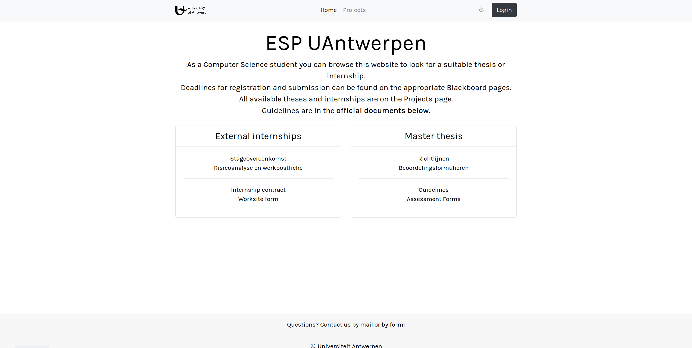
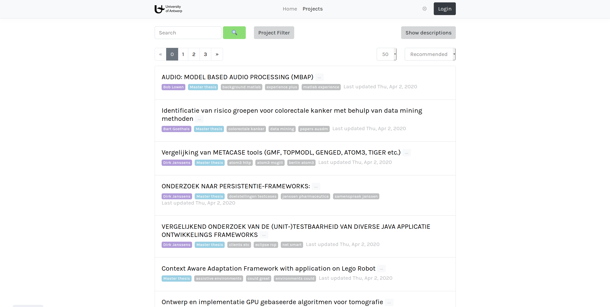
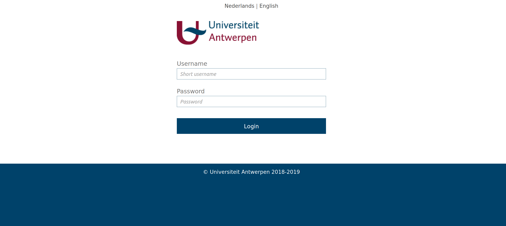

# ESP UAntwerp

Site for master students to pick a project for their thesis or other courses.
Allows professors to publish their project ideas and have an overview of which students are
interested.

- [Features](#features)
- [How It Works](#how-it-works)
- [Preview](#preview)
- [Install](#install)


Initially made as a university assignment by
 [MaxVanHoucke](https://github.com/MaxVanHoucke),
 [ThomasVanOnsem](https://github.com/ThomasVanOnsem),
 [ChristophRonken](https://github.com/ChristophRonken) and
 [DanielleJongstra](https://github.com/DJongstra).
 

## Features

- Students can browse the projects, favorite them and express interest
- Professors can publish project ideas with collaborators,
- Smart recommendation system that is personal to each student
- Integration of an existing LDAP system to support login of students and professors
- Options for dark mode and different languages


## How It Works

PostgreSQL is used for the database.
Outside of the basic tables there is also a slightly more complex materialized view and index
created for the search functionality of projects.

Furthermore we have Flask as the main server technology.  
The *src/controllers* folder contains all the endpoints that serve html templates from the *src/templates* folder
and also contains helper endpoints that provide necessary functionality such as retrieving all projects etc.  
The *src/static* folder is served directly as well. It contains all static files such as images, stylesheets and
Javascript files.  
The *src/models* folder is self explanatory and simple contains all the models in the database along with DAO's to access them.
The *src/tests* folder contains some scenario tests using Selenium. 

Lastly we have the client-side which is Javascript with some JQuery, Bootstrap and
 a couple of smaller Bootstrap related libraries.
 Most data is retrieved by AJAX calls and displayed dynamically on the page.

## Preview





## Install

### Python

Usage of a [virtualenv](https://virtualenv.pypa.io/en/latest/) is recommended but not necessary.

To install the packages run the following command

```
pip3 install -r requirements.txt
```

If the installation of psycopg2 fails on Linux, try to install the following

```
sudo apt install libpq-dev python3-dev
```

### PostgreSQL

If not yet installed on Linux, do the following

```
sudo apt install postgresql
```

#### Create a new role/password and database

```
sudo -i -u postgres
postgres@server:~$ createuser --interactive
~ Create user with name 'esp'
postgres@server:~$ createdb esp
postgres@server:~$ psql
postgres=# \password esp
~ Enter password
```

### Configuration file

At src/config.py the following should be present

```
config_data = {
    'dbname': '',
    'dbuser': '',
    'dbpass': '',
    'dbhost': '',
    'secret-key': '',
    'file-storage': ''
}
```

The *dbname*, *dbuser*, *dbpass* and *dbhost* should of course be set to the values of the
postgresql configuration used.

If the above tutorial on postgresql was followed these values are 
*esp*, *esp*, *chosen_password* and *localhost* respectively.

Fill in the *secret-key* with the result of the following command, as described in the official docs 
[here](https://flask.palletsprojects.com/en/1.0.x/quickstart/#sessions).
```
python3 -c 'import os; print(os.urandom(16))'
```

The *file-storage* has to be an absolute path where the user will be able to upload files to.
Additionally, *file-storage*/home should be a directory with the documents for the home page.


### Initialize tables

Now that the database and configuration files are set, we can initialize the tables.
Simply execute the following command

```
python3 install.py
```

If you have an sql file that you want to execute after install, for example a file with inserts to 
populate the database, run the following command instead

```
python3 install.py your_file.sql
```

To initialize the search for your start data, run the following command 
```
sudo -u postgres psql -d esp -c 'REFRESH MATERIALIZED VIEW search_index;'
```


### LDAP

At src/controllers/auth/config.py the following should be present

```
config_data = {
    'server': '',
    'suffix': ''
}
```

This is the LDAP *server* and user *suffix*.
The *suffix* will be added to the user's login before sending the request to LDAP.
Mind that in the case of the UA network, a VPN is necessary to use the LDAP connection.


### Run

Finally, simply execute the following

```
python3 run.py
```
